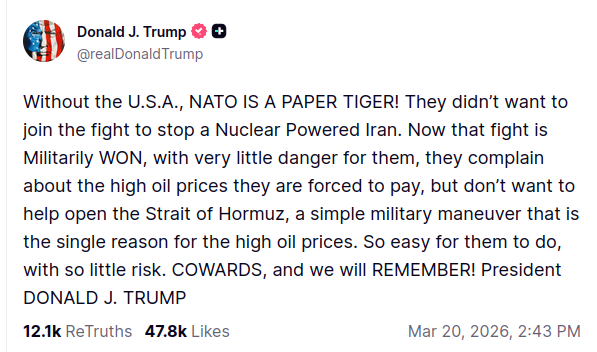

# NATO Strategic Capacities Visualised

This documents is a draft outline of the end product we'll be implementing for the course in Data Visualisation at Ghent University.
It aims at exploring NATO's strategic capabilities by focusing on budget and hard power, through data provided by both NATO and [Global Firepower](https://globalfirepower.com/).

Currently, we're aiming for a _scrollystelling_-style website using (e.g.) [Scrollama](https://pudding.cool/process/introducing-scrollama/) that enables users to both read our own story and explore the data themselves, using visualisations brought by [Vega Lite](https://vega.github.io/vega-lite/).
The [draft storyline](#draft-storyline) focuses on the storyline, while the specific graph's captions will have to provide the necessary context that isn't provided in the text to keep reading fluent.

## Draft Storyline

### 0. The Arsenal of Democracy?

Global headlines are increasingly dominated by a singular anxiety: the era of peace is over.
Russia and China are standing at our borders, armed to the teeth and searching for the one crack in our armor that would allow them to sweep across the continent.
That is if we are to believe the current US President, at least.
Central to this fear is the North-Atlantic Treaty Organisation (NATO).
Donald Trump famously argues that NATO is little more than the United States in a trench coat — an American powerhouse surrounded by "cowardly" allies who refuse to contribute both financially and military.

 [^1]

Is this true?
As countries pivot away from the _peace dividend_ and begin funneling billions back into their war chests, we decided to look past the rhetoric.
By analyzing NATO’s own financial audits and Global Firepower’s hardware data, we aim to uncover the reality of the Alliance's strategic weight.
Is the European pillar finally standing on its own, or is the shield truly made in the USA?

### 1. Before the Billions: Securing a Broken Continent

In order to truly understand the contemporary situation, it is necessary to understand _how_ and _why_ NATO came to be.
For this, we must travel back to 1949 — to a fragile Europe trying to heal the scars left behind from the Second World War.
In a new, bipolar world divided between the influence of the US and the USSR, twelve nations gathered in Washington to sign a pact that would redraw the strategic map of the West forever.

> Twelve nations form the original shield:
>
> - Belgium,
> - Canada,
> - Denmark,
> - France,
> - Iceland,
> - Italy,
> - Luxemburg,
> - Norway,
> - Portugal,
> - The Netherlands,
> - the UK, and
> - the USA
>
> From this, the goal would be to add a new step showing the new members for each of the following years.
> I believe the best approach would be to color the countries that already had joined were to be colored in NATO light blue #118ACB, with new countries being colored in the complementary color (being #cb5211).

As the Cold War froze the borders of Europe, NATO’s first expansion focused on securing the _Southern Flank_ and the heart of the continent.
In 1952, Greece and Turkey joined to anchor the Mediterranean.
They were followed in 1955 by West Germany, a pivotal move that integrated the former frontline of the war into the Western defense architecture.
By the time Spain joined in 1982, the alliance had grown into a sixteen-nation bulwark.

> The map expands to include the Mediterranean and the divided German front

The Fall of the Berlin Wall in 1989 and the subsequent collapse of the Soviet Union fundamentally changed NATO’s purpose.
No longer just a Cold War shield, the alliance became a tool for stabilising a newly free Eastern Europe.
In 1999, former Warsaw Pact [^2] members the Poland, Hungary, and the Czech Republic let the way and joined the West.

Just five years later, in 2004, NATO underwent its most ambitious expansion to date.
Seven nations, including the three Baltic States of Estonia, Latvia, and Lithuania, joined together with Bulgaria, Romania, Slovenia and Slovakia in a single wave.
This move shifted the alliance’s borders directly to the doorstep of the former Soviet Union.

> massive blue wave sweeps accross central and eastern Europe

In the last two decades, the focus has shifted again; this time toward the Balkans, with the accession of Albania, Croatia, Montenegro, and North Macedonia.
However, the most dramatic pivot occurred in 2023 and 2024.
As a direct response to Russia’s invasion of Ukraine and a radically changed safety situation, the long-neutral Nordic giants Finland and Sweden joined the alliance.

> Show final map indicating the alliance in full power

What began as a small club of twelve has transformed into a 32-nation powerhouse. [^3]
As the map grew, so did the friction: can 32 different nations truly share the burden of an alliance that Trump calls "the United States in a trench coat"?

### 2. The Price of Protection: Who is actually paying?

If NATO is a "shield," then the defense budget is the cost of the steel.
For decades, the United States has shouldered the majority of the financial burden; a fact that led to the friction we see in modern politics.
In 2014, the Alliance set a clear benchmark: every member should spend at least **2% of its GDP** on defense. [^4]

> TODO: graph showing 2014 share of GDP for defense indicating the 2% threshold\
> Note to self: can be interesting to look at countries that have a large portion, probably countries close to Russia?

For a long time, many European allies fell short, enjoying what economists call the _peace dividend_.
However, the world changed in 2022 with Russia's invasion of Ukraine.
Our data shows a radical pivot: defense budgets are no longer stagnating; they are surging.

> TODO: chart showing real change (%) in budgets from 2014 to 2025.
> Notice the sharp upward trajectory for countries bordering Russia?

#### More than just Salaries

But where does that money actually go?
A common criticism is that European armies spend too much on pensions and salaries, and not enough on the hard power needed for modern war.
NATO targets a **20% minimum** for key equipment that provides hard combat power, like missiles, fighter jets, combat vehicles... [^5]

> TODO: chart showing expenditure shares
> Perhaps might be interesting to allow comparing/selecting countries?

By breaking down the portion of expenditure, we can see which countries are simply maintaining the status quo and which are actively building the arsenal of the future.

#### The Weight of the Titan?

To understand the friction within NATO, we have to look past percentages and look at raw cash.
In 2023, the United States spent nearly **twice as much** on defense as the rest of the 31 allies combined.

> TODO: add chart showing this comparison

While almost every member now meets the 2% threshold, the absolute dollar amounts reveal the true scale of American dominance.
For every $1 spent by a European ally, the US spends nearly $2.
However, this might be an unfair comparison, as there are no countries that have the population number the US has.

Total billions can be misleading.
To see the true "fairness" of the alliance, we must ask: how much does the average citizen contribute to the shield? By factoring in population, we move from the power of nations to the commitment of individuals.

> TODO: show expenditure per capita in a bar chart?

When viewed per capita, the "spending gap" begins to shrink.
While the US still leads, citizens in nations like Norway and the Baltic states often shoulder a personal financial burden that rivals or even exceeds that of the average American.
This data suggests that the "cowardly" label ignores the significant personal investment made by people living on the alliance's frontlines. [^6]
This figure is also shown in the number of soldiers per 1,000 inhabitants:

> TODO: show number of soldiers in relative and absolute numbers next to each other\
> Note to self: two horizontal bar charts? Pictogram or waffle charts showing blocks of thousands of soldiers?

[^1]: D. J. Trump (@realDonaldTrump), "Without the U.S.A., NATO IS A PAPER TIGER!," Truth Social, Mar. 20, 2026. [Online]. Available: <https://truthsocial.com/@realDonaldTrump>. [Accessed: Mar. 30, 2026].

[^2]: the Warsaw Pact was NATO's biggest challenger during the Cold War era.
    Backed by the Soviet Unions nuclear umbrella, many communist countries joined forming a defensive alliance of 8 members a its peak, with a few notable observers.
    See also: [Warsaw Pact](https://en.wikipedia.org/wiki/Warsaw_Pact).

[^3]: There are some notable countries not included in the NATO alliance.
    The most well-known is of course Switzerland, which has known a history of neutrality since centuries ago.
    However, the attentive reader also notices some EU countries missing on the map: Ireland, Austria, Cyprus and Malta are also holding on to their military neutrality, which is often anchored in their constitutions.
    Although this fundamental objection to picking a side, these countries often cooperate with NATO in the so-called [**Partnership for Peace**-programme](https://www.nato.int/en/what-we-do/partnerships-and-cooperation/partnership-for-peace-programme).

    > It might be interesting to include a map showing all EU countries, coloured into NATO/EU and just NATO or EU members in different colours to provide more information and context to the readers.

[^4]: in 2025, NATO increased this benchmark to a minimum core budget of 3.5% of a countries GDP, with a goal of 5% in total. [source](https://www.nato.int/content/dam/nato/webready/documents/publications-and-reports/annual-reports/sgar25-en.pdf)

[^5]: NATO, "Defence Expenditure of NATO Countries (2014-2024)," NATO, Brussels, Belgium, June 2024. Accessed: Mar. 30, 2026. [Online]. Available: <https://www.nato.int/content/dam/nato/webready/documents/finance/def-exp-2025-en.pdf>

[^6]: Recently, Donald Trump downplayed the contribution of NATO allies in Afghanistan following the American invasion after 9/11.
    Numbers show that although in absolute numbers, the US lost most soldiers by far, relatively speaking more Danish soldiers laid their lifes in combat for the US.
    The campaign in Afghanistan was the only time NATO's famous Article 5 was activated, another fact President Trump failed to recognise.
    [source](https://www.bbc.com/news/articles/crmjewpkje9o)
